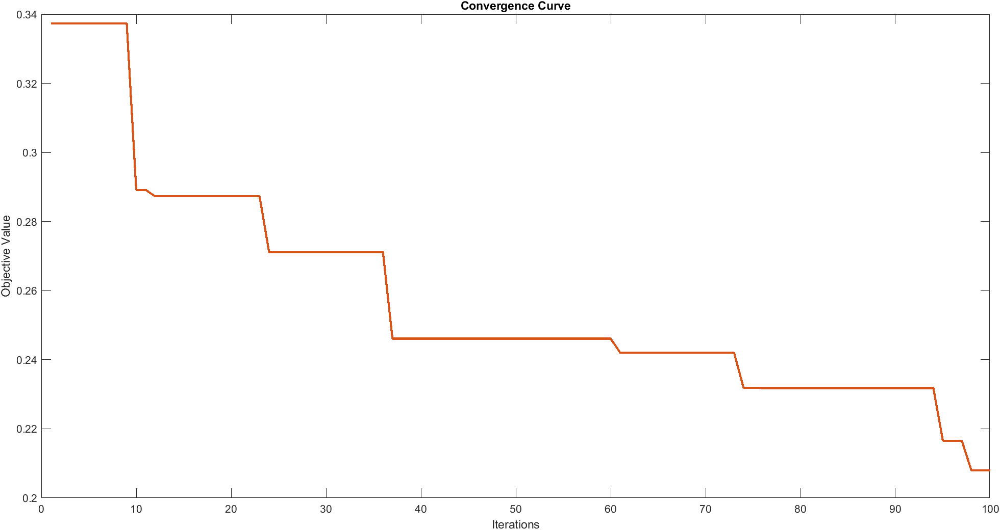

# Multi-Verse Optimizer for PID parameters optimization problem

## PID parameters optimization problem
Considering the following characteristic equation:

$A(s)=s^4+7s^3+(7K_d+11.6)s^2+7K_ps+7K_I=0$

Given

$roots(A(s)) =a_1 ± jb_1, a_2 ± jb_2, a_3 ± jb_3, a_4 ± jb_4$

Considering the minimization function below:

$\min(\max(a_1, a_2, a_3, a_4))$

The objective is to find the optimal parameters such that

$3 ≥ K_p ≥ 0.001$

$3 ≥ K_d ≥ 0.001$

$3 ≥ K_I ≥ 0.001$

## Introduction to Multi-Verse Optimizer(MVO)[(Mirjalili et al. 2016)](https://doi.org/10.1007/s00521-015-1870-7)

Most of the population-based stochastic optimization techniques are inspired by nature. As the method name suggests the white hole, black hole, and wormhole are the inspirations of this algorithm. This Method like many other population-based methods starts with creating a set of random solutions and then they combine, move, or evolve over iterations. This algorithm also keeps the balance between exploration and exploitation and can guarantee to proceed toward the global optimum.

<p align="center">

</p>

## Results
### the program output:


```
>> [best_universe, fObj, Eig_Max, Rts] = MVO_AliK

best_universe =
    2.9946    0.9469    1.2847

fObj =
    0.2080

Eig_Max =
   -1.5701

Rts =
   -2.2359 + 0.0000i
   -1.6238 + 0.0000i
   -1.5701 + 0.1079i
   -1.5701 - 0.1079i
```
<p align="center">

</p>

### RouletteWheelSelection function([“Roulette Wheel Selection - File Exchange - MATLAB CentralFile Exchange - MATLAB Central.” 2015. December 15, 2015.](https://www.mathworks.com/matlabcentral/fileexchange/45735-roulette-wheel-selection.)):


```
% Based on Roulette wheel selection
% input is an array of any real number values
% output is the selection of one of the elements marked by its index
% location
function [index] =  RouletteWheelSelection(arrayInput)
len = length(arrayInput);
% if input is one element then just return rightaway
if len ==1
    index =1;
    return;
end
if (~isempty(find(arrayInput<1, 1)))
    if (min(arrayInput) ~=0)
    arrayInput = 1/min(arrayInput)*arrayInput;
    else
    temp= arrayInput;
    temp(arrayInput==0) = inf;
    arrayInput = 1/min(temp)*arrayInput;
    end
end
temp = 0;
tempProb = zeros(1,len);
for i= 1:len
    tempProb(i) = temp + arrayInput(i);
    temp = tempProb(i);
end
i = fix(rand*floor(tempProb(end)))+1;
index = find(tempProb >= i, 1 );
```
